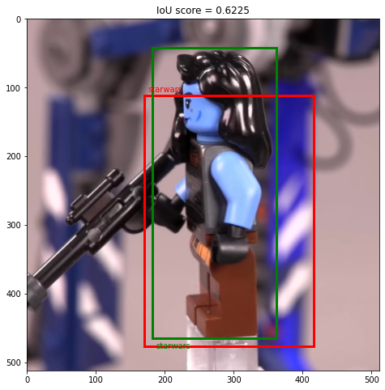

<!-- PROJECT TITLE AND SUB-TITLE -->
<h1 align="center">Marvel-Vs-StarWars-Localization</h1>
  <h3 align="center">
    Classification and Localization of a Single Object with Pytorch.
  </h3>

<!-- PROJECT LOGO -->
 

  

<!-- TABLE OF CONTENTS -->

  
Table of Contents

  <ol>
    <li>
      <a href="#intro">Introduction</a>
    </li>
    <li>
      <a href="#method">Methodology</a>
      <ul>
        <li><a href="#archi">Architecture</a></li>
        <li><a href="#loss">Loss Functions</a></li>
        <li><a href="#eval">Evaluation Criterias</a></li>
      </ul>
    </li>
    <li>
      <a href="#result">Result Analysis</a>
    </li>
    <li>
      <a href="#data">Dataset</a>
    </li>
    <li>
      <a href="#use">How to Use the Project?</a>
      <ul>
        <li><a href="#prerequisites">Prerequisites</a></li>
        <li><a href="#installation">Installation</a></li>
      </ul>
    </li>
    <li><a href="#license">License</a></li>
    <li><a href="#contact">Contact</a></li>
    <li><a href="#references">References</a></li>
  </ol>

<!-- Introduction -->
<h2 id='intro'> Introduction </h2>
Write introduction here.
* Introduction item 1

<!-- Methodology -->
<h2 id='method'> Methodology </h2>
Write methodology here.

<!-- ### Architecture -->
<h3 id='archi'> Architecture </h3>
<!-- ### Loss Functions -->
<h3 id='loss'> Loss Functions </h3>
<!-- ### Evaluation Criterias -->
<h3 id='eval'> Evaluation Criterias </h3>

<!-- Result Analysis -->
<h2 id='result'> Result Analysis </h2>
Write Result Analysis here.

<!-- Dataset -->
<h2 id='data'> Dataset </h2>
Write about dataset here.

<!-- How to Use the Project? -->
<h2 id='use'> How to Use the Project </h2>

<!-- ### Prerequisites -->
<h3 id='prerequisites'> Prerequisites </h3>

<!-- ### Installation -->
<h3 id='installation'> Installation </h3>

<!-- LICENSE -->
<h2 id='license'> License </h2>

Distributed under the MIT License. See `LICENSE` for more information.

<!-- CONTACT -->
<h2 id='contact'> Contact </h2>

Mehedi Hasan Bijoy - [@Facebook](https://facebook.com/mhbsheikh) - [@LinkedIn](https://www.linkedin.com/in/mhbsheikh/)  
Project Link: [Marvel VS StarWars Localization](https://github.com/mehedihasanbijoy/Marvel-Vs-StarWars-Localization)

<!-- References -->
<h2 id='references'> References </h2>

<!-- MARKDOWN LINKS & IMAGES -->
<!-- https://www.markdownguide.org/basic-syntax/#reference-style-links -->
[contributors-shield]: https://img.shields.io/github/contributors/othneildrew/Best-README-Template.svg?style=for-the-badge
[contributors-url]: https://github.com/othneildrew/Best-README-Template/graphs/contributors
[forks-shield]: https://img.shields.io/github/forks/othneildrew/Best-README-Template.svg?style=for-the-badge
[forks-url]: https://github.com/othneildrew/Best-README-Template/network/members
[stars-shield]: https://img.shields.io/github/stars/othneildrew/Best-README-Template.svg?style=for-the-badge
[stars-url]: https://github.com/othneildrew/Best-README-Template/stargazers
[issues-shield]: https://img.shields.io/github/issues/othneildrew/Best-README-Template.svg?style=for-the-badge
[issues-url]: https://github.com/othneildrew/Best-README-Template/issues
[license-shield]: https://img.shields.io/github/license/othneildrew/Best-README-Template.svg?style=for-the-badge
[license-url]: https://github.com/othneildrew/Best-README-Template/blob/master/LICENSE.txt
[linkedin-shield]: https://img.shields.io/badge/-LinkedIn-black.svg?style=for-the-badge&logo=linkedin&colorB=555
[linkedin-url]: https://linkedin.com/in/othneildrew
[product-screenshot]: images/screenshot.png
